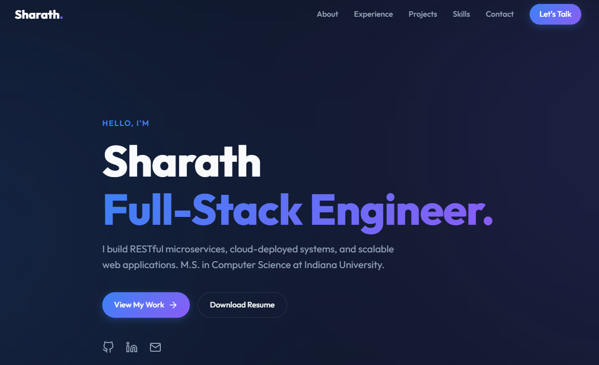

# Sharath - Software Engineer Portfolio



A modern, highly aesthetic, and responsive developer portfolio built with React, Vite, and TypeScript. Designed to showcase my experience as a Full-Stack Software Engineer with a focus on clean UI/UX, glassmorphism design, and smooth scroll-driven animations.

## ✨ Features

- **Modern Aesthetic**: Dark mode by default, featuring a dynamic animated mesh gradient background and premium glassmorphic UI components.
- **Bi-Directional Scroll Animations**: Sections and cards gracefully blur and fade into view as you scroll up or down.
- **Responsive Layout**: Fully optimized for mobile, tablet, and desktop viewing.
- **Skill Showcase**: Integrated with `react-icons` for authentic brand representations of technical skills.
- **Performance Optimized**: Built on Vite for lightning-fast HMR and highly optimized production builds.

## 🛠️ Tech Stack

- **Framework**: React 18
- **Build Tool**: Vite
- **Language**: TypeScript
- **Styling**: Vanilla CSS (CSS Variables, Flexbox/Grid, Glassmorphism)
- **Icons**: `react-icons`

## 🚀 Getting Started Locally

To run this project on your local machine, follow these steps:

### Prerequisites
Make sure you have [Node.js](https://nodejs.org/) installed on your machine.

### Installation

1. Clone the repository:
   ```bash
   git clone https://github.com/Sharlnu-IU/portfolio.git
   cd portfolio
   ```

2. Install dependencies:
   ```bash
   npm install
   ```

3. Start the development server:
   ```bash
   npm run dev
   ```

4. Open your browser and navigate to `http://localhost:5173`.

## 📦 Build for Production

To create a production-ready build:

```bash
npm run build
```
This will compile the TypeScript code and bundle the React application into the `/dist` directory. You can preview the production build locally using `npm run preview`.

## 🌐 Deployment (GitHub Pages)

This project is configured out-of-the-box to be deployed easily to GitHub pages via the `vite.config.ts` base path setting (`base: './'`). 

1. Build the project (`npm run build`).
2. Push the contents of the `/dist` folder to a `gh-pages` branch on your repository.
3. Enable GitHub pages in your repository settings pointing to the `gh-pages` branch.

## 📄 License

This project is licensed under the MIT License - see the [LICENSE](LICENSE) file for details.
